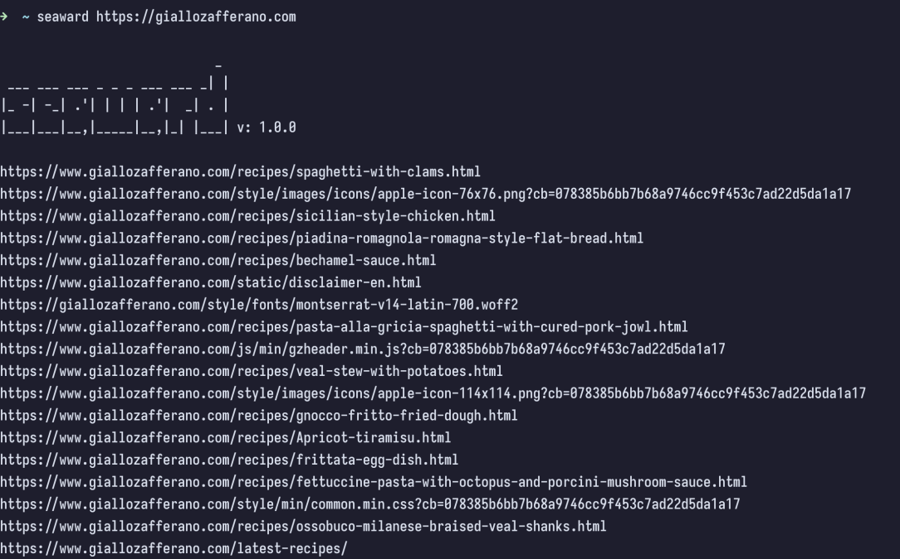
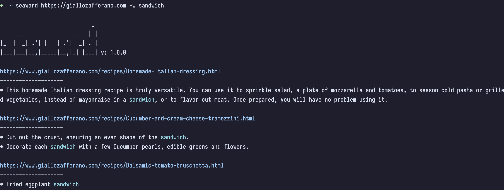

## Introduction & motivation

Seaward is a web crawler which **searches for all kinds of links or a case unsensitive word inside webpages**, the idea came to my mind because sometimes when i visit a not so well designed website and i don't know where to go, i would like to do a "global search".

### Considerations

The project is made in **rust** and it is my first time using this language, you can find the **installation methods** at the beginning of the README on the github repository. 

If you wonder if it is fast, well, it is fast, but _it could be faster_. 
At the moment it uses only 2 threads, where one is used to detect a keyboard interrupt from the user, and the other is the main thread which uses **asynchronous functions** (implemented with a view to implementing a more efficient multithreading system in the future) but at the moment the performance does not differ too much from a sequential approach.

### Showcase

[source code](https://github.com/M3nny/seaward)
